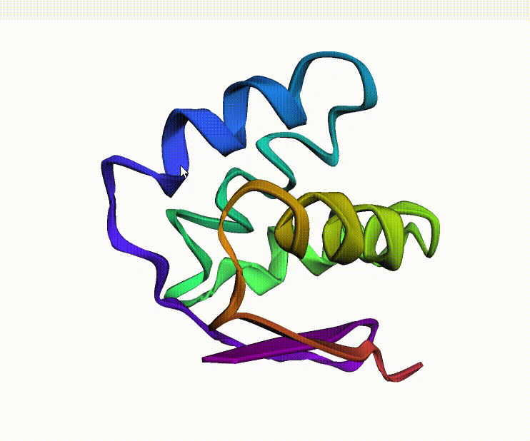
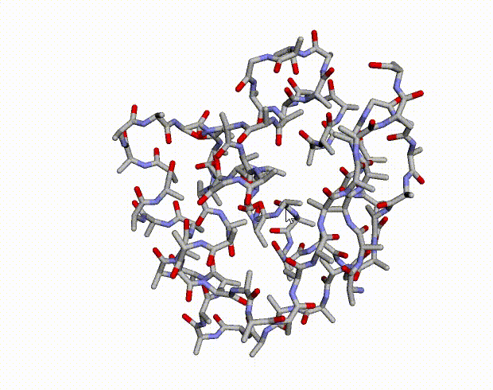
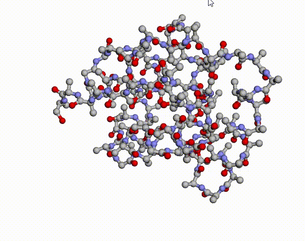

# dmpfold
- Ref: https://github.com/psipred/DMPfold2.git
>📖 Using in python 3.8+ by normal dmpfold will using in Python 3.6 because it will have to use tensorflow version 1.19- otherwise error such as tensorflow 2.15.0 in colab

### 1. Fix error of tensorflow new
- Rename file fix_network.py to network.py or copy text in fix_network.py replace in /usr/local/lib/python3.10/dist-packages/dmpfold/network.py
and
```cmd
% example
sudo rm -rf /usr/local/lib/python3.10/dist-packages/dmpfold/network.py
```
```cmd
sudo mv 'location file at Rename file fix_network.py to network.py' /usr/local/lib/python3.10/dist-packages/dmpfold/
```
### 2. Test order dmpfold
```cmd
% Not cuda
dmpfold -i input.aln > fold.pdb
```
```
% cuda
dmpfold -i input.aln -d cuda:0 > fold.pdb
```
### 3. Show model 3D file.pdb 'cartoon'
```python
import py3Dmol

# Read the PDB file
with open('/content/DMPfold2/dmpfold/example/seq.pdb', 'r') as file:
    pdb_data = file.read()

# Create a viewer
view = py3Dmol.view(width=800, height=600)
view.addModel(pdb_data, 'pdb')
view.setStyle({'cartoon': {'color': 'spectrum'}})
view.zoomTo()
view.show()
```



### 4. Show model 3D file.pdb 'stick'
```python
import py3Dmol

# Function to visualize molecule from a .pdb file
def visualize_pdb(file_path):
    with open(file_path, 'r') as f:
        data = f.read()

    viewer = py3Dmol.view(width=800, height=600)
    viewer.addModel(data, 'pdb')
    viewer.setStyle({'stick': {}})
    viewer.zoomTo()
    return viewer.show()

# Replace 'file.pdb' with your .pdb file path
file_path = '/content/DMPfold2/dmpfold/example/seq.pdb'
visualize_pdb(file_path)
```


### 5. Show model 3D file.pdb 'Ball-stick'
```python
import py3Dmol

def visualize_pdb(file_path):
    with open(file_path, 'r') as f:
        data = f.read()

    viewer = py3Dmol.view(width=800, height=600)
    viewer.addModel(data, 'pdb')
    
    # Example customizations
    viewer.setStyle({'stick': {}, 'sphere': {'scale': 0.3}})  # Ball-and-stick representation
    
    viewer.zoomTo()
    return viewer.show()

# Replace 'file.pdb' with your .pdb file path
file_path = '/content/DMPfold2/dmpfold/example/seq.pdb'
visualize_pdb(file_path)
```


># Example customizations
- viewer.setStyle({'cartoon': {'color': 'spectrum'}})  # Cartoon representation with spectrum coloring
- viewer.setStyle({'surface': {}})                 # VDW surfacer epresentation
- viewer.setStyle({'line': {}})                    # Lines representation
- viewer.setStyle({'stick': {}, 'sphere': {'scale': 0.3}})  # Ball-and-stick representation
